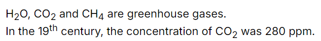

# carta-plugin-subscript

This plugin adds ability to render subscripts and superscripts to [Carta](https://github.com/BearToCode/carta).

## Installation

```shell
npm i carta-plugin-subscript
```

## Setup

### Extension

```svelte
<script>
	import { Carta, CartaEditor } from 'carta-md';
	import { subscript } from 'carta-plugin-subscript';

	const carta = new Carta({
		extensions: [subscript()],
	});
</script>

<CartaEditor {carta} />
```

## Usage

This snippet:

```
H~2~O, CO~2~ and CH~4~ are greenhouse gases.
In the 19^th^ century, the concentration of CO~2~ was 280 ppm.
```

will generate this output:


